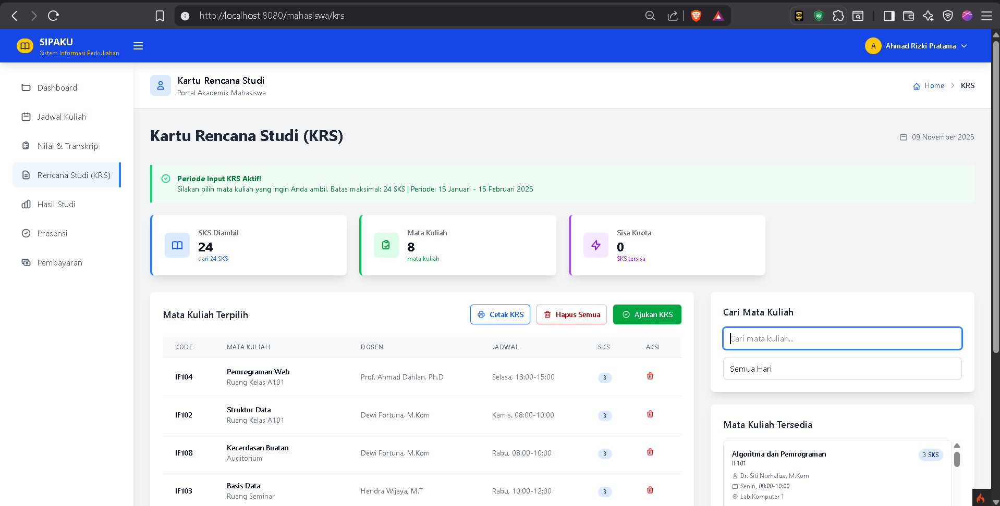
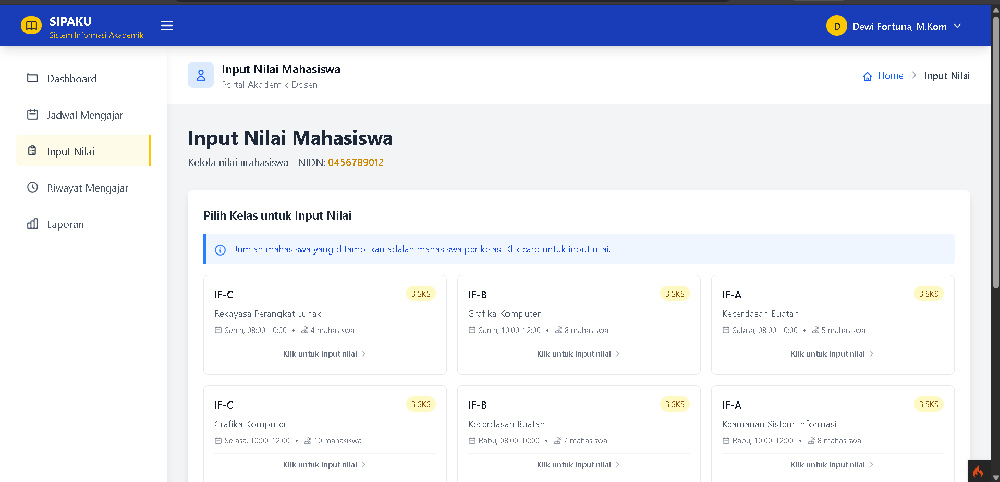

# SIPAKU - Sistem Informasi Perkuliahan Akademik Ku


Sistem Informasi Perkuliahan Akademik Ku (SIPAKU) adalah aplikasi web untuk mengelola data akademik perguruan tinggi yang dibangun menggunakan CodeIgniter 4 dengan antarmuka modern berbasis TailwindCSS dan Preline UI.

## 🚀 Fitur Utama

### 👨‍💼 Admin Dashboard
- **Dashboard Analytics**: Statistik real-time (total mahasiswa, dosen, ruangan, jadwal, users)
- **Recent Activities**: Tracking aktivitas terbaru di sistem
- **Manajemen Mahasiswa**: CRUD data mahasiswa dengan validasi NIM
- **Manajemen Dosen**: CRUD data dosen dengan validasi NIDN
- **Manajemen Mata Kuliah**: Kelola mata kuliah dengan kode dan SKS
- **Manajemen Jadwal**: 
  - Penjadwalan kuliah dengan validasi konflik waktu
  - Validasi konflik ruangan dan dosen
  - Sorting dan filtering jadwal
- **Manajemen Ruangan**: Kelola data ruang kuliah
- **Manajemen Users**: Kelola akun pengguna sistem
- **Search & Filter**: Pencarian data dengan AJAX
- **Data Export**: Export data ke CSV (mahasiswa, dosen, ruangan, jadwal)

### 🎓 Fitur Mahasiswa
- **Dashboard Mahasiswa**: 
  - Statistik akademik (Total SKS, IPK, Semester Aktif, Mata Kuliah Aktif)
  - Jadwal kuliah hari ini
- **Kartu Rencana Studi (KRS)**:
  - Input KRS dengan validasi maksimal 24 SKS
  - Validasi konflik jadwal
  - Validasi mata kuliah duplikat
  - Submit KRS untuk persetujuan
  - Cetak KRS (Print View)
  - Status KRS (draft/submitted)
- **Jadwal Kuliah**: 
  - Lihat jadwal kuliah lengkap dengan detail dosen, ruangan, dan waktu
  - Sorting berdasarkan hari
- **Nilai & Transkrip**:
  - Lihat nilai per mata kuliah
  - Transkrip nilai lengkap
  - Perhitungan IPK otomatis
- **Hasil Studi**:
  - Statistik hasil studi (Total SKS, SKS Lulus, Total Mata Kuliah)
  - Rata-rata nilai
  - Total nilai mutu

### 👨‍🏫 Fitur Dosen
- **Dashboard Dosen**:
  - Statistik mengajar (Total Jadwal, Total Mahasiswa, Total Mata Kuliah, Nilai Pending)
  - Jadwal mengajar hari ini
- **Jadwal Mengajar**: 
  - Lihat semua jadwal mengajar
  - Jumlah mahasiswa per kelas
  - Filter berdasarkan ruangan
- **Input Nilai Mahasiswa**:
  - Input nilai per kelas/jadwal
  - Konversi otomatis nilai angka ke huruf (A, A-, B, B-, C, D, E)
  - Validasi nilai (0-100)
  - Batch input nilai untuk seluruh mahasiswa dalam satu kelas

## 🛠️ Teknologi yang Digunakan

- **Backend**: CodeIgniter 4.x (PHP Framework)
- **Frontend**: 
  - TailwindCSS 4.x (Utility-first CSS Framework)
  - Preline UI 3.x (UI Components)
  - jQuery 3.7.1
  - DataTables.net (untuk tabel interaktif)
- **Database**: MySQL 8.0+ / MariaDB 10.4+
- **JavaScript**: Vanilla JS & jQuery dengan AJAX
- **Build Tools**: Vite 7.x (untuk asset compilation)
- **Package Manager**: 
  - Composer (PHP dependencies)
  - NPM (JavaScript dependencies)

## 📋 Persyaratan Sistem

### Server Requirements
- **PHP**: 7.4, 8.0, atau 8.1+
- **Database**: MySQL 8.0+ atau MariaDB 10.4+
- **Web Server**: Apache 2.4+ (dengan mod_rewrite) atau Nginx 1.18+
- **Composer**: 2.0+
- **Node.js**: 16.x+ dan NPM 8.x+

### PHP Extensions (Required)
- `intl` - Internationalization support
- `mbstring` - Multibyte string support
- `mysqlnd` - MySQL Native Driver
- `curl` - HTTP client library
- `json` - JSON support (enabled by default)
- `xml` - XML support

### PHP Extensions (Optional)
- `gd` - Image processing
- `zip` - Zip archive support

## 🚀 Instalasi

### 1. Clone Repository
```bash
git clone https://github.com/your-username/sipaku.git
cd sipaku
```

### 2. Install Dependencies
```bash
composer install
npm install
```

### 3. Environment Setup
```bash
# Copy environment file
cp env .env

# Edit .env file
nano .env
```

### 4. Database Configuration
Edit file `.env` dan sesuaikan konfigurasi database:
```env
# Database
database.default.hostname = localhost
database.default.database = sipaku_db
database.default.username = your_username
database.default.password = your_password
database.default.DBDriver = MySQLi

# Base URL
app.baseURL = 'http://localhost:8080/'

# Environment
CI_ENVIRONMENT = development
```

### 5. Database Migration & Seeding
```bash
# Run migrations
php spark migrate

# Run seeders (untuk data dummy dan user default)
php spark db:seed DatabaseSeeder
```

**Seeder akan membuat:**
- Data mahasiswa dummy
- Data dosen dummy
- Data mata kuliah
- Data ruangan
- Data jadwal
- Data nilai mutu (A, A-, B, B-, C, D, E)
- User admin, dosen, dan mahasiswa default
- Data rencana studi (KRS) dummy

### 6. Build Assets
```bash
# Development
npm run dev

# Production
npm run build
```

### 7. Start Development Server
```bash
php spark serve
```

Aplikasi akan berjalan di `http://localhost:8080`

## 📁 Struktur Project

```
sipaku/
├── app/
│   ├── Controllers/
│   │   ├── Admin/              # Admin controllers
│   │   │   ├── Dashboard.php   # Dashboard admin
│   │   │   ├── Mahasiswa.php   # CRUD mahasiswa
│   │   │   ├── Dosen.php       # CRUD dosen
│   │   │   ├── MataKuliah.php  # CRUD mata kuliah
│   │   │   ├── Jadwal.php      # CRUD jadwal
│   │   │   ├── Ruangan.php     # CRUD ruangan
│   │   │   └── Users.php       # CRUD users
│   │   ├── Dosen/              # Dosen controllers
│   │   │   └── DosenController.php
│   │   ├── Mahasiswa/          # Mahasiswa controllers
│   │   │   └── MahasiswaController.php
│   │   └── auth/               # Authentication
│   │       └── Login.php
│   ├── Models/                 # Database models
│   │   ├── MahasiswaModel.php
│   │   ├── DosenModel.php
│   │   ├── MataKuliahModel.php
│   │   ├── JadwalModel.php
│   │   ├── RuanganModel.php
│   │   ├── RencanaStudiModel.php
│   │   ├── NilaiMutuModel.php
│   │   └── UserModel.php
│   ├── Views/
│   │   ├── admin/              # Admin views
│   │   │   ├── dashboard.php
│   │   │   ├── mahasiswa/
│   │   │   ├── dosen/
│   │   │   ├── mata_kuliah/
│   │   │   ├── jadwal/
│   │   │   ├── ruangan/
│   │   │   └── users/
│   │   ├── dosen/              # Dosen views
│   │   │   ├── dashboard.php
│   │   │   ├── jadwal.php
│   │   │   └── nilai_input.php
│   │   ├── mahasiswa/          # Mahasiswa views
│   │   │   ├── dashboard.php
│   │   │   ├── krs.php
│   │   │   ├── krs_print.php
│   │   │   ├── jadwal.php
│   │   │   ├── nilai.php
│   │   │   └── hasil_studi.php
│   │   ├── auth/               # Auth views
│   │   │   └── login.php
│   │   └── layout/             # Layout templates
│   │       ├── admin/
│   │       ├── dosen/
│   │       └── mahasiswa/
│   ├── Database/
│   │   ├── Migrations/         # Database migrations
│   │   └── Seeds/              # Database seeders
│   ├── Config/                 # Configuration files
│   ├── Filters/                # Request filters
│   ├── Helpers/                # Helper functions
│   └── Libraries/              # Custom libraries
├── public/
│   ├── assets/                 # Compiled assets (CSS, JS)
│   ├── index.php               # Entry point
│   └── .htaccess
├── resources/                  # Source assets
│   ├── css/
│   │   └── app.css
│   └── js/
│       └── app.js
├── vendor/                     # Composer dependencies
├── node_modules/               # NPM dependencies
├── writable/                   # Writable directories
│   ├── cache/
│   ├── logs/
│   ├── session/
│   └── uploads/
├── .env                        # Environment configuration
├── composer.json               # PHP dependencies
├── package.json                # JavaScript dependencies
├── vite.config.js              # Vite configuration
├── tailwind.config.js          # Tailwind configuration
└── preline.config.js           # Preline configuration
```

## 🎨 UI Components & Features

Aplikasi menggunakan komponen UI modern dengan:
- **Responsive Design**: Mobile-first approach, optimal di semua device
- **Interactive Components**: 
  - Modals untuk form input/edit
  - Dropdowns untuk navigasi
  - Toast notifications untuk feedback
  - Loading states
- **Data Tables**: 
  - DataTables.net integration
  - Advanced filtering dan search
  - Pagination
  - Sorting columns
  - Export to CSV
- **Form Validation**: 
  - Real-time validation dengan feedback
  - Client-side & server-side validation
  - Error messages yang jelas
- **AJAX Operations**: 
  - CRUD operations tanpa reload halaman
  - Real-time data updates
  - Smooth user experience
- **Print Layout**: 
  - Print-friendly KRS layout
  - Optimized untuk cetak dokumen

## D Database Schema

Aplikasi menggunakan 8 tabel utama:

1. **mahasiswa**: Data mahasiswa (NIM, nama, krs_status)
2. **dosen**: Data dosen (NIDN, nama)
3. **mata_kuliah**: Data mata kuliah (kode, nama, SKS)
4. **ruangan**: Data ruangan kuliah
5. **jadwal**: Jadwal kuliah (hari, jam, kelas, relasi ke mata_kuliah, dosen, ruangan)
6. **rencana_studi**: KRS mahasiswa (relasi ke mahasiswa & jadwal, nilai)
7. **nilai_mutu**: Konversi nilai huruf ke bobot (A=4.00, A-=3.50, dst)
8. **users**: Akun pengguna sistem (username, password, role)

### Relasi Database
- `jadwal` → `mata_kuliah` (many-to-one)
- `jadwal` → `dosen` (many-to-one)
- `jadwal` → `ruangan` (many-to-one)
- `rencana_studi` → `mahasiswa` (many-to-one)
- `rencana_studi` → `jadwal` (many-to-one)
- `users` → `mahasiswa`/`dosen` (one-to-one via kode)

## 🔧 Development

### Code Style
- Follow PSR-12 coding standards
- Use meaningful variable and function names
- Comment complex logic
- Keep functions small and focused

### Database Conventions
- Table names: `snake_case` (singular/plural sesuai konteks)
- Column names: `snake_case`
- Primary keys: `id_[table_name]` atau `[unique_field]` (NIM, NIDN)
- Foreign keys: `id_[referenced_table]` atau `[field_name]`
- Timestamps: `created_at`, `updated_at`

### Frontend Guidelines
- Use TailwindCSS utility classes
- Keep JavaScript modular
- Use semantic HTML
- Ensure accessibility compliance
- AJAX untuk operasi CRUD
- Consistent error handling

## 🔐 Authentication & Authorization

Sistem menggunakan session-based authentication dengan role-based access control:

### Roles
- **Admin**: Akses penuh ke semua fitur manajemen
- **Dosen**: Akses ke dashboard dosen, jadwal mengajar, dan input nilai
- **Mahasiswa**: Akses ke dashboard mahasiswa, KRS, jadwal, dan nilai

### Login Credentials (Default Seeder)
Setelah menjalankan seeder, gunakan kredensial berikut:

**Admin:**
- Username: `admin`
- Password: `admin`

**Dosen:**
- Username: `[NIDN dosen]`
- Password: `[NIDN dosen]`

**Mahasiswa:**
- Username: `[NIM mahasiswa]`
- Password: `[NIM mahasiswa]`

## 🛣️ Routes & Endpoints

### Public Routes
- `GET /` - Home/Landing page
- `GET /login` - Login page
- `POST /login/authenticate` - Process login
- `GET /logout` - Logout

### Admin Routes (Prefix: `/admin`)
- `GET /admin/dashboard` - Admin dashboard
- **Mahasiswa**: `/admin/mahasiswa` (index, create, show, update, delete)
- **Dosen**: `/admin/dosen` (index, create, show, update, delete)
- **Mata Kuliah**: `/admin/mata-kuliah` (index, create, show, update, delete)
- **Jadwal**: `/admin/jadwal` (index, create, show, update, delete)
- **Ruangan**: `/admin/ruangan` (index, create, show, update, delete)
- **Users**: `/admin/users` (index, create, show, update, delete)

### Dosen Routes (Prefix: `/dosen`)
- `GET /dosen/dashboard` - Dosen dashboard
- `GET /dosen/jadwal` - Jadwal mengajar
- `GET /dosen/nilai` - Input nilai
- `GET /dosen/nilai/mahasiswa/{jadwal_id}` - Get mahasiswa by jadwal
- `POST /dosen/nilai/save` - Save nilai mahasiswa

### Mahasiswa Routes (Prefix: `/mahasiswa`)
- `GET /mahasiswa/dashboard` - Mahasiswa dashboard
- `GET /mahasiswa/krs` - Kartu Rencana Studi
- `POST /mahasiswa/krs/add` - Add mata kuliah to KRS
- `POST /mahasiswa/krs/remove` - Remove mata kuliah from KRS
- `POST /mahasiswa/krs/submit` - Submit KRS
- `GET /mahasiswa/krs/print` - Print KRS
- `GET /mahasiswa/jadwal` - Jadwal kuliah
- `GET /mahasiswa/nilai` - Nilai & transkrip
- `GET /mahasiswa/hasil-studi` - Hasil studi

### AJAX Endpoints
- `POST /admin/jadwal/check-conflict` - Check schedule conflict
- `GET /admin/jadwal/mata-kuliah` - Get mata kuliah list
- `GET /admin/jadwal/dosen` - Get dosen list
- `GET /admin/jadwal/ruangan` - Get ruangan list
- `GET /admin/dashboard/tab-data/{type}` - Get tab data
- `POST /admin/dashboard/search` - Search data

**Mahasiswa:**
- Username: `[NIM mahasiswa]`
- Password: `[NIM mahasiswa]`

## 🧪 Testing

```bash
# Run all tests
php spark test

# Run specific test
php spark test App\\Tests\\Models\\UserModelTest
```

## 📝 Fitur Validasi

### Validasi KRS Mahasiswa
- Maksimal 24 SKS per semester
- Tidak boleh mengambil mata kuliah yang sama (kelas berbeda)
- Validasi konflik jadwal (hari dan jam)
- Status KRS (draft/submitted) - setelah submit tidak bisa diubah

### Validasi Jadwal
- Validasi konflik ruangan (ruangan tidak boleh dipakai 2 kelas di waktu yang sama)
- Validasi konflik dosen (dosen tidak boleh mengajar 2 kelas di waktu yang sama)
- Validasi overlap waktu

### Validasi Nilai
- Nilai angka: 0-100
- Konversi otomatis ke nilai huruf:
  - A: 85-100
  - A-: 80-84
  - B: 70-79
  - B-: 65-69
  - C: 55-64 (Batas Lulus)
  - D: 40-54
  - E: 0-39

## 📊 Fitur Perhitungan Akademik

### Perhitungan IPK
```
IPK = Total Nilai Mutu / Total SKS
Nilai Mutu = Bobot Nilai × SKS Mata Kuliah
```

### Bobot Nilai
- A = 4.00
- A- = 3.50
- B = 3.00
- B- = 2.50
- C = 2.00
- D = 1.00
- E = 0.00

### Status Kelulusan
- Lulus: Nilai ≥ C (bobot ≥ 2.00)
- Tidak Lulus: Nilai < C (bobot < 2.00)

## 🚀 Deployment

### Production Checklist
1. Set `CI_ENVIRONMENT = production` di `.env`
2. Disable debug mode
3. Set proper `app.baseURL`
4. Configure database credentials
5. Run migrations: `php spark migrate`
6. Build assets: `npm run build`
7. Set proper file permissions untuk `writable/`
8. Configure web server (Apache/Nginx)
9. Enable HTTPS
10. Set secure session configon

### Web Server Configuration

**Apache (.htaccess sudah included)**
```apache
# Sudah tersedia di public/.htaccess
```

**Nginx**
```nginx
server {
    listen 80;
    server_name your-domain.com;
    root /path/to/sipaku/public;
    
    index index.php;
    
    location / {
        try_files $uri $uri/ /index.php?$query_string;
    }
    
    location ~ \.php$ {
        fastcgi_pass unix:/var/run/php/php8.1-fpm.sock;
        fastcgi_index index.php;
        fastcgi_param SCRIPT_FILENAME $document_root$fastcgi_script_name;
        include fastcgi_params;
    }
}
```

## 🤝 Contributing

1. Fork repository
2. Create feature branch (`git checkout -b feature/amazing-feature`)
3. Commit changes (`git commit -m 'Add amazing feature'`)
4. Push to branch (`git push origin feature/amazing-feature`)
5. Open Pull Request

### Development Guidelines
- Ikuti PSR-12 coding standards
- Tulis kode yang clean dan maintainable
- Tambahkan komentar untuk logika kompleks
- Test fitur sebelum commit
- Update dokumentasi jika diperlukan

## 📄 License

This project is licensed under the MIT License - see the [LICENSE](LICENSE) file for details.

## Trooubleshooting

### Error: "Class not found"
```bash
# Clear cache dan regenerate autoload
composer dump-autoload
php spark cache:clear
```

### Error: Database connection failed
- Pastikan MySQL/MariaDB sudah running
- Cek konfigurasi database di file `.env`
- Pastikan database sudah dibuat
- Cek username dan password database

### Error: Assets tidak muncul
```bash
# Rebuild assets
npm run build

# Atau untuk development
npm run dev
```

### Error: Permission denied pada folder writable
```bash
# Linux/Mac
chmod -R 777 writable/

# Windows: Pastikan folder writable memiliki write permission
```

### Error: 404 Not Found setelah instalasi
- Pastikan mod_rewrite Apache sudah enabled
- Cek file `.htaccess` di folder `public/`
- Pastikan `app.baseURL` di `.env` sudah benar

## 🐛 Known Issues & Limitations

- Export CSV feature di dashboard admin (commented out, perlu implementasi lebih lanjut)
- Dark mode belum diimplementasikan
- Semester aktif masih hardcoded (perlu integrasi dengan sistem akademik)
- Tahun akademik masih hardcoded di print KRS
- Belum ada sistem notifikasi email
- Belum ada fitur reset password

## A Future Enhancements

- [ ] Dark/Light mode toggle
- [ ] Email notifications untuk persetujuan KRS
- [ ] Dashboard charts & analytics
- [ ] Mobile app (PWA)
- [ ] Export to PDF
- [ ] Bulk import data (Excel/CSV)
- [ ] Sistem persetujuan KRS oleh admin/dosen wali
- [ ] Riwayat perubahan KRS
- [ ] Kalender akademik
- [ ] Absensi mahasiswa
- [ ] Evaluasi dosen oleh mahasiswa

## 🆘 Support

Jika mengalami masalah atau memiliki pertanyaan:

1. **Issues**: [GitHub Issues](https://github.com/Cahyadi-Prasetyo/sipaku/issues)
2. **Documentation**: [Wiki](https://github.com/Cahyadi-Prasetyo/sipaku/wiki)
3. **Email**: [cahyadi.informatics@gmail.com]

## 📸 Screenshots

### Admin Dashboard


### Mahasiswa - KRS


### Dosen - Input Nilai


## 🙏 Acknowledgments

### Backend
- [CodeIgniter 4](https://codeigniter.com/) - PHP Framework
- [Composer](https://getcomposer.org/) - Dependency Manager for PHP

### Frontend
- [TailwindCSS 4.x](https://tailwindcss.com/) - Utility-first CSS Framework
- [Preline UI 3.x](https://preline.co/) - UI Components Library
- [jQuery 3.7.1](https://jquery.com/) - JavaScript Library
- [DataTables.net](https://datatables.net/) - Advanced Table Plugin

### Build Tools
- [Vite 7.x](https://vitejs.dev/) - Next Generation Frontend Tooling
- [NPM](https://www.npmjs.com/) - Package Manager

### Development Tools
- [Prettier](https://prettier.io/) - Code Formatter
- [PHPUnit](https://phpunit.de/) - Testing Framework

## 👨‍💻 Developer

Developed with ❤️ for academic purposes

## 📞 Contact

Untuk pertanyaan, saran, atau kontribusi:
- **GitHub**: [Cahyadi-Prasetyo](https://github.com/Cahyadi-Prasetyo)
- **Email**: [cahyadi.informatics@gmail.com]
- **Issues**: [GitHub Issues](https://github.com/Cahyadi-Prasetyo/sipaku/issues)

## 📄 Changelog

### Version 1.0.0 (Current - November 2025)
- ✅ Sistem autentikasi dengan role-based access (Admin, Dosen, Mahasiswa)
- ✅ Admin dashboard dengan statistik real-time
- ✅ CRUD lengkap untuk mahasiswa, dosen, mata kuliah, jadwal, ruangan, users
- ✅ Sistem KRS mahasiswa dengan validasi lengkap
- ✅ Input nilai oleh dosen dengan batch processing
- ✅ Perhitungan IPK otomatis
- ✅ Print KRS dengan layout profesional
- ✅ Validasi konflik jadwal (ruangan & dosen)
- ✅ Responsive design untuk semua device
- ✅ AJAX operations untuk UX yang smooth
- ✅ DataTables integration untuk tabel interaktif
- ✅ Search & filter functionality
- ✅ Recent activities tracking

## 📊 Project Statistics

- **Total Files**: 100+
- **Lines of Code**: 10,000+
- **Database Tables**: 8
- **Controllers**: 10+
- **Models**: 8
- **Views**: 30+

## 🏆 Features Highlights

✨ **Modern UI/UX** - Clean, intuitive interface dengan Preline UI  
🚀 **Fast Performance** - Optimized dengan Vite build tool  
🔒 **Secure** - Session-based authentication & input validation  
📱 **Responsive** - Mobile-first design approach  
🎯 **User-Friendly** - Easy to use untuk semua role  
⚡ **Real-time** - AJAX operations tanpa reload halaman  

---

**SIPAKU** - Memudahkan pengelolaan akademik dengan teknologi modern 🎓

Made with ❤️ using CodeIgniter 4 & TailwindCSS
